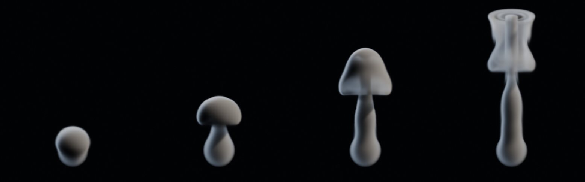

# Elements Suite

An open-source, Rust-based suite of real-time VFX authoring tools for Blender. The core engine (`crates/`) is dual-licensed Apache-2.0 OR MIT; the Blender add-on (`addon/`) and the Blender-side benchmark scripts (`tests/bench/`) are GPL-3.0-or-later. `vendor/vdb-rs/` is a patched copy of Traverse Research BV's MIT-licensed `vdb-rs` (see its `PATCHED.md`).



## Status

Early. The engine, its smoke solver and the solver's scene content work; fire, a live viewport preview and the rest of what a production smoke tool needs are still to come.

**What exists today**

- **The engine** runs as its own process next to Blender, so a solver crash shows a disconnect banner instead of costing you your `.blend`. It is Rust on [wgpu](https://wgpu.rs) and uses no optional GPU features, so the same code runs on Metal and Vulkan. CI runs the full test suite on software Vulkan (llvmpipe) on every push.
- **A node graph and a headless CLI** that bake a scene to an OpenVDB sequence without Blender.
- **A GPU smoke solver** (`crates/elements-ember`) on a dense grid:
  - staggered (MAC) velocity;
  - MacCormack advection over an RK2 backtrace, with trilinear sampling done by hand;
  - substeps chosen each frame from the flow speed (CFL), capped per quality preset;
  - Boussinesq buoyancy, vorticity confinement and dissipation;
  - pressure projection warm-started from the previous frame, with walls or open faces chosen per side, by MGPCG (the presets' default: 4 iterations in preview, 10 in final; see `docs/bench/solver-gate.md`) or, per document (`pressure_solver`, `pressure_cycles`, `pressure_iterations`), multigrid V-cycles or red-black Gauss–Seidel;
  - `preview` and `final` quality presets;
  - keyframed sphere and box emitters that add density and temperature, modulated by seeded noise measured in metres, and can pull the fluid toward a target velocity;
  - keyframed sphere and box colliders, moving or still, whose surfaces carry their own velocity;
  - unions of emitters and of colliders;
  - a global mass correction on density and temperature after each advection, on in both presets. It rescales the whole field, so it fixes the total but not where mass sits, and it skips any field that holds a negative value before advection (temperature with hot and cold emitters), since a proportional rescale assumes one sign;
  - wind as an ambient airflow that the air relaxes towards (`wind_velocity`, `wind_rate`).

  Emitters and colliders are node kinds in an `.elements` document; the Blender add-on does not expose them yet. A frame is bit-identical however you reach it: playing forward, scrubbing back, or restoring from the cache, including with animated emitters and colliders.

**How fast it is.** Piece 2a's speed gate, on a 128³ grid on an Apple M1 Max (Metal), with semi-Lagrangian advection and a fixed single substep, and the pass/fail rule fixed before anything was measured:

| Pressure iterations | ms per step | Divergence left after projection |
|---|---|---|
| 80 | 19.9 | 11.8% |
| **160 (default)** | **34.1** | **4.3%** |
| 480 | 94.4 | 0.76% |

The full tables and conditions are in [`docs/bench/speed-gate.md`](docs/bench/speed-gate.md) and [`docs/bench/iteration-sweep.md`](docs/bench/iteration-sweep.md). With MacCormack, RK2 and the per-frame CFL measurement, a default `preview` frame, with MGPCG ×4 and the mass correction, takes about 71 ms at 128³, measured under load ([`docs/bench/presets.md`](docs/bench/presets.md); risks (j) and (k) in §6 of [the solver spec](docs/superpowers/specs/2026-09-21-ember-solver-design.md)). The images above are a 256³ run: 120 frames simulated in 93 seconds, including writing every frame to OpenVDB, then rendered offline in Cycles.

**Against Mantaflow.** [`docs/bench/results.md`](docs/bench/results.md) compares Ember with Blender's built-in Mantaflow solver in three matched scenes at 64³, 128³ and 256³. Ember's frames are 5.8–8.4× faster, and it uses 0.36–0.62× the memory. In `plume` and `plume_collider`, its mass drift at frame 80 is under 1e-6 of the frame-60 mass, and in `plume_collider`, where almost no smoke leaves, it stays under 1.5e-6 through frame 120. It leaves less divergence than Mantaflow everywhere except in two scenes at 256³, which the report names along with the other places Mantaflow still wins. Every run was measured under load.

**Not yet**

- Fire. The plume above is smooth and laminar because vorticity confinement, though implemented, is off by default (`vorticity` is 0 in both presets) and off in the example scene.
- A live preview in the Blender viewport. Today you bake to VDB and load the sequence.

The design documents are in [`docs/superpowers/specs/`](docs/superpowers/specs/), and the risks the next milestone starts from are in §6 of [the solver spec](docs/superpowers/specs/2026-09-21-ember-solver-design.md).

## Try the smoke solver

After the [development setup](#development-setup) below, bake the example plume:

```bash
cargo run --release -p elements-cli -- bake examples/plume.elements \
    --out plume-vdb --frames 1-120 --voxel-size 0.015625
```

This simulates a 128³ plume in a 2 m domain and writes `plume-vdb/density.0001.vdb` onwards, about 8.5 MB per frame. The voxel size, 2 m / 128, makes the VDB the same size in Blender as the simulated domain. In Blender, use **File → Import → OpenVDB (.vdb)**, select the first file, and keep **Detect Sequences** enabled to import the whole range.

## Development setup

### Prerequisites

- **`mise`** — pins Python 3.11, ruff, uv, just, and cargo-nextest. Install from https://mise.jdx.dev/.
- **`rustup`** — owns the Rust toolchain via `rust-toolchain.toml`. Install from https://rustup.rs/.
- **On macOS: Xcode Command Line Tools** — run `xcode-select --install`. This is required because `.cargo/config.toml` pins the linker to `/usr/bin/cc`; if Nix or another toolchain provides a `cc` earlier on `$PATH`, linking fails with "symbol(s) not found for architecture arm64".

### Quick start

```bash
mise install
direnv allow  # optional
just check
```

`just check` runs linting and tests. For other tasks, run `just` to list all recipes.

### Alternative: Nix

If you prefer a fully declarative environment, run `nix develop` to enter a Nix shell with all dependencies.

### Common recipes

- **`just fmt`** — Format Rust and Python code.
- **`just lint`** — Check formatting, run Clippy, and lint Python. Fails on any warning.
- **`just test`** — Run the Rust test suite on your native GPU backend.
- **`just ci-test`** — Run tests on software Vulkan (same as CI).
- **`just check`** — Run lint and test (required before committing).
- **`just addon`** — Build and verify the Blender extension ZIP.
- **`just golden`** — Regenerate golden test files (review outputs before committing).
- **`just blender-test`** — Run the Blender integration test (requires Blender installed).
