# Ember and Mantaflow side by side

- Machine: Apple M1 Max
- OS: macOS 27.2
- Ember commit: eb6b1c1
- Blender: 5.2.2 LTS
- Date: 2026-09-25

Written by `just bench-render` (`tests/bench/render_compare.py`), 2b-3b spec §3.
Each image shows one frame of one scene: Ember's density on the left and
Mantaflow's on the right, each in its 2 m domain drawn as a thin box. Both are
baked from the same scene definition (`Scene` in `crates/elements-ember/src/bench`,
through `benchmark document` and `benchmark scene-json`), Ember by
`elements-cli bake` and Mantaflow by `tests/bench/mantaflow_scene.py`, simulated
from frame 1. The images are for judging by eye; nothing here measures them.

## Render settings

- Cycles, 64 samples a pixel (adaptive sampling off), seed 0, denoiser
  off, 960×540, Standard view transform, rendered on the GPU (Metal)
  when there is one.
- One orthographic camera looking along +y, so both domains are seen through
  the same projection: no perspective, and depth along y is not visible.
- Both Volume objects read their file's `density` grid at full precision and
  share one Principled Volume material: colour white, **density 20**
  (a multiplier on the grid value), absorption colour black, no emission, no
  blackbody.
- A sun key light (strength 10, 3° wide) from the camera's upper
  left, a soft sun fill (strength 2, 40° wide) from its lower
  right, and a uniform world of grey 0.18 at strength 1.
- Placement: both files put voxel i's centre at i·dx, half a cell below the
  cell's centre, so each object is moved by +0.5·dx on every axis
  (`tests/bench/placement.py`). Mantaflow's domain is 1.25 domains to the right
  of Ember's.

**One density scale for both is fair**: while both solvers are still emitting
and the plumes have not yet diverged, the emitted masses match: over frames
12–24, Ember's mass is 0.99–1.04× Mantaflow's across every benchmark run
(`docs/bench/results.md`, Notes, Heat). The scale is not normalised per
solver, so a difference in brightness or opacity is a difference in density.
Known differences carry through (`results.md`, `mantaflow-notes.md`):
Mantaflow's emitter heat is held at Ember's frame-24 value rather than added
at Ember's rate, so its plume rises faster; Mantaflow's open top boundary layer
is a density sink; and Mantaflow clamps density to [0, 1] at the emitter while
Ember does not, so Ember's densest cells can exceed 1.

Verdict (recorded by the user): _pending_

## `plume` (128³)

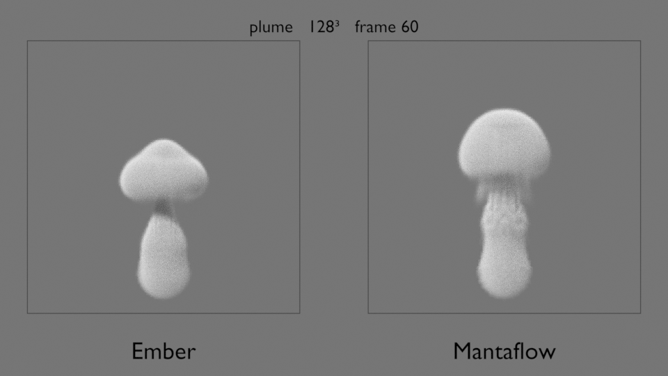

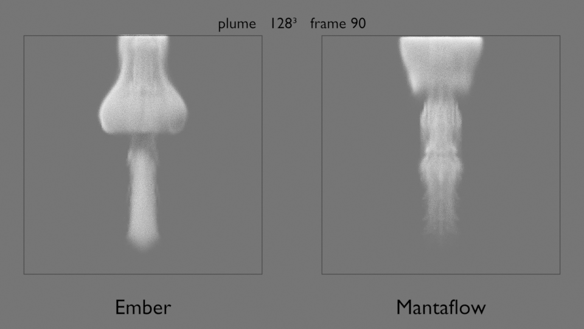

## `plume_collider` (128³)

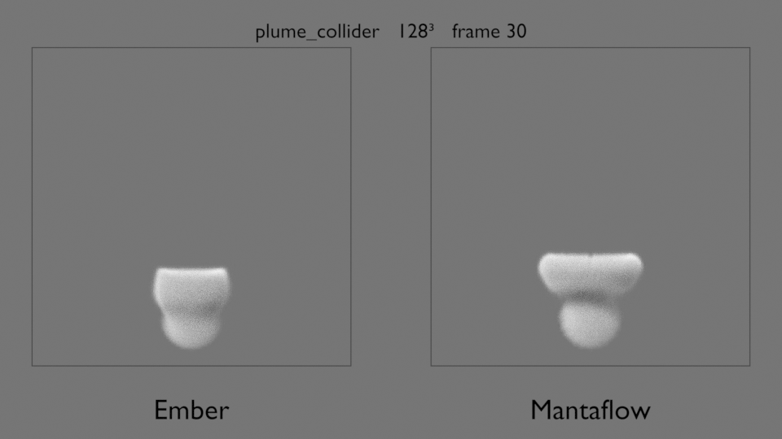

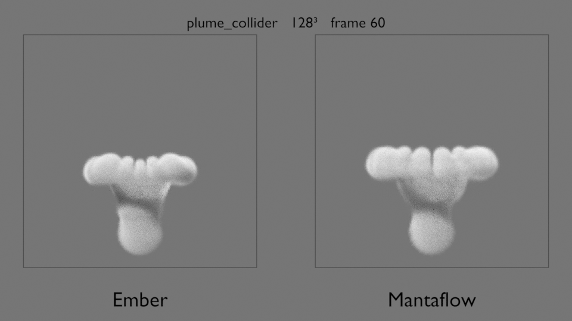

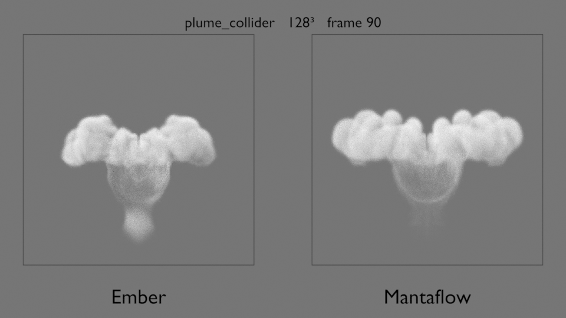

## `plume_wind` (128³)

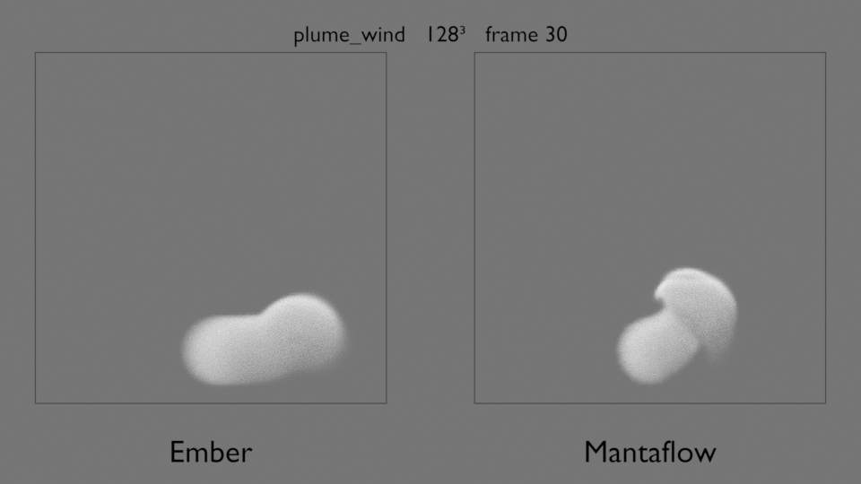

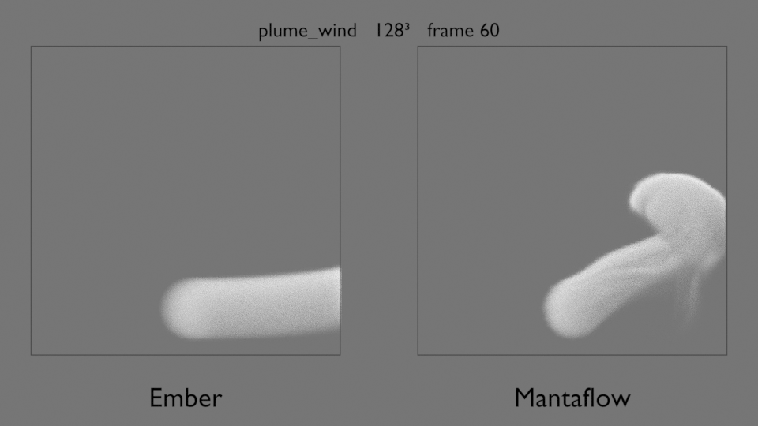

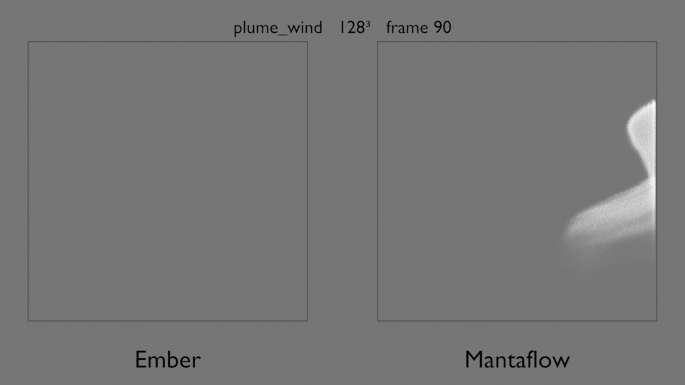

## `plume` (256³)

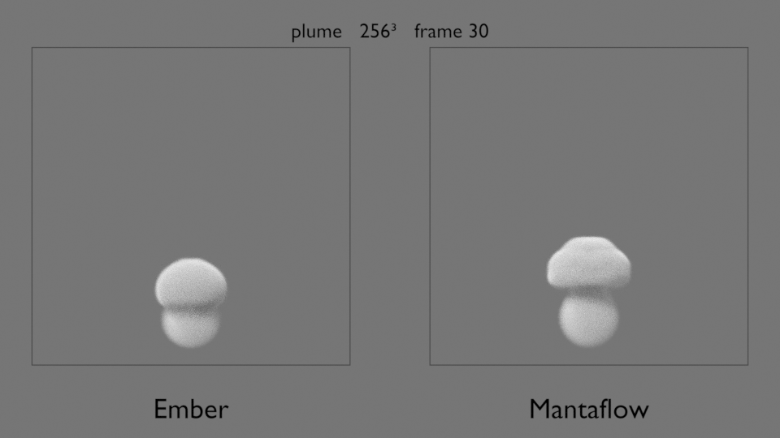

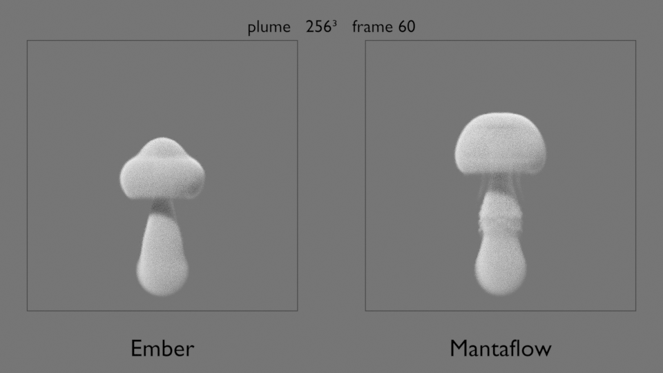

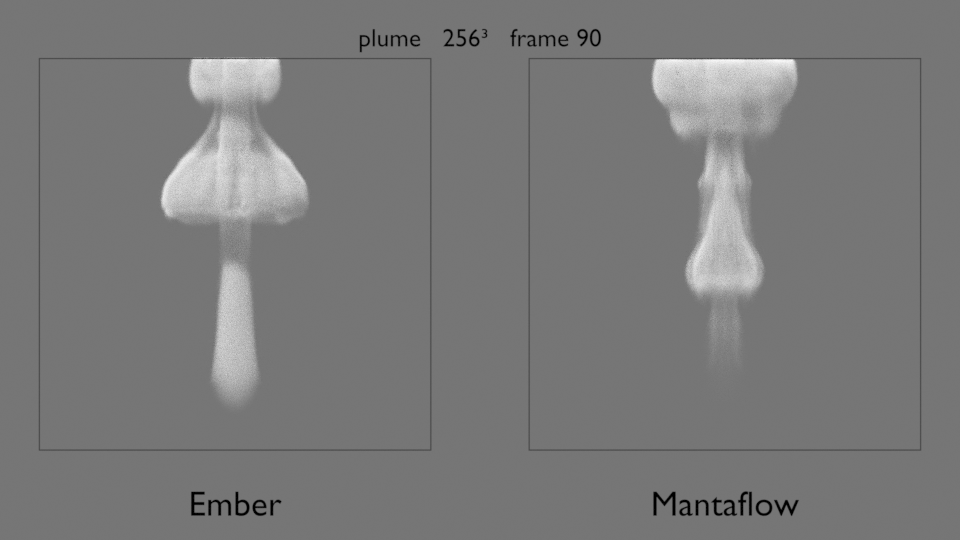
