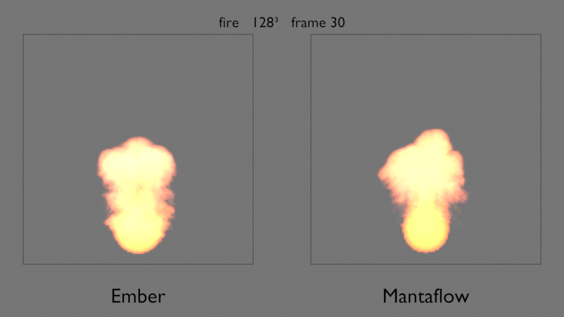
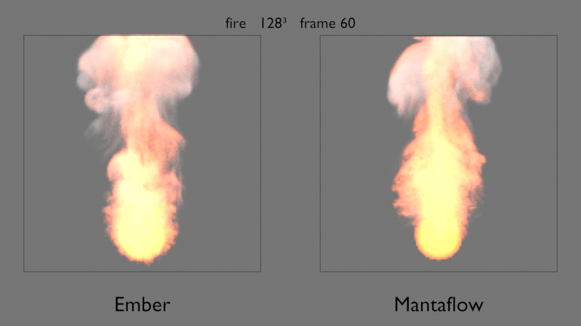
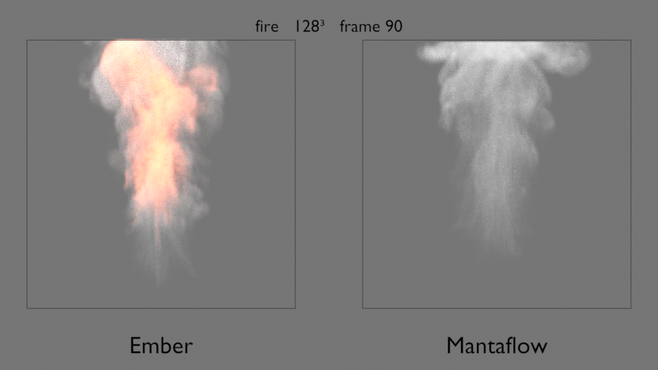

# Ember and Mantaflow side by side

- Machine: Apple M1 Max
- OS: macOS 27.2
- Ember bakes' commit: eb6b1c1, fa59464-dirty (`fire`)
- Mantaflow bakes' commit: 2e1f9a9-dirty (the uncommitted change was the render scripts; `git diff 2e1f9a9..eb6b1c1` touches no scene or solver code), fa59464-dirty (`fire`; the uncommitted changes were the render scripts, the `bench-render` recipe and `examples/presets.rs`, none of them scene or solver code)
- Blender: 5.2.2 LTS
- Date: 2026-09-25

Written by `just bench-render` (`tests/bench/render_compare.py`), 2b-3b spec §3.
Each image shows one frame of one scene: Ember's density on the left and
Mantaflow's on the right, each in its 2 m domain drawn as a thin box.
Both are baked from the same scene definition
(`Scene` in `crates/elements-ember/src/bench`, through `benchmark document`
and `benchmark scene-json`), Ember by `elements-cli bake` and Mantaflow by
`tests/bench/mantaflow_scene.py`. Mantaflow bakes frames 1–90 once. Ember is
baked once for each of frames 30, 60 and 90, and each bake simulates from
frame 1 and writes only that frame; the simulation is deterministic, and a
rebake gives byte-identical files. The images are for judging by eye;
nothing here measures them.

## Render settings

- Cycles, 64 samples a pixel (adaptive sampling off), seed 0, denoiser
  off, 960×540, Standard view transform. Device:
  GPU (Apple M1 Max (GPU - 32 cores)).
- One orthographic camera looking along +y, so both domains are seen through
  the same projection: no perspective, and depth along y is not visible.
- Both Volume objects read their file's `density` grid at full precision and
  share one Principled Volume material: colour white, **density 20**
  (a multiplier on the grid value), absorption colour black, no emission, no
  blackbody.
- A sun key light (strength 10, 3° wide) from the camera's upper
  left, a soft sun fill (strength 2, 40° wide) from its lower
  right, and a uniform world of grey 0.18 at strength 1.
- Placement: both files put voxel i's centre at i·dx, half a cell below the
  cell's centre, so each object is moved by +0.5·dx on every axis
  (`tests/bench/placement.py`). Mantaflow's domain is 1.25 domains to the right
  of Ember's.

**One density scale for both is fair**: while both solvers are still emitting
and the plumes have not yet diverged, the emitted masses match: over frames
12–24, Ember's mass is 0.99–1.04× Mantaflow's across every benchmark run
(`docs/bench/results.md`, Notes, Heat). The scale is not normalised per
solver, so a difference in brightness or opacity is a difference in density.
At density 20, though, a plume's core is optically thick (τ ≈ 6: the
multiplier times grid values near 1 over a core about 0.3 m across), so the
images compare shape and extent rather than peak density.
Known differences carry through (`results.md`, `mantaflow-notes.md`):
Mantaflow's emitter heat is held at Ember's frame-24 value rather than added
at Ember's rate, so its plume rises faster; Mantaflow's open top boundary layer
is a density sink; and Mantaflow clamps density to [0, 1] at the emitter while
Ember does not, so Ember's densest cells can exceed 1 (behind an optically
thick core, that changes little in the image).

Verdict (recorded for the user by Claude at their request, 2026-09-25): at
matched emitted mass, Ember reproduces Mantaflow's large-scale behaviour in
`plume` and `plume_collider`: the rise, the mushroom cap, and the flow over and
around the collider, where the two match most closely. `plume_wind` differs by
construction, not by accuracy: Ember's ambient airflow moves all the air, so its
plume is bent into a low band and carried out through +x (the domain is empty
by frame 90), while Mantaflow's wind pushes only the smoke, which rises
diagonally and piles against +x. In `plume`, Ember is visibly smoother:
Mantaflow keeps finer turbulent detail in the stem (streaks and ripples by
frame 60, wisps and bulges by 90) and at frame 60 a larger cap about 0.1 of the
domain higher. That agrees with Mantaflow's 1.7–1.9× kinetic energy per measured
cell at frame 60 in `plume` at the rendered resolutions (1.08–2.12× in
`plume_collider`, rising with resolution; `docs/bench/results.md`); part of the
height is the heat mapping (Mantaflow's emitter is hotter early), not the
solver. By frame 90 that reverses at the top: Mantaflow's cap is flattened
against the open top and has lost 46% of its frame-60 mass against Ember's
17%, so there Ember's cap is the larger. In both scenes at frame 90 Ember keeps
a low blob near the emitter that Mantaflow does not, and in `plume_collider`
Mantaflow's lobes spread wider. The remaining gap is Ember's small-scale
detail. The levers are less numerical dissipation in advection, vorticity
confinement (0 in both solvers' bench settings today), and the ML
upresolution seam; a heat mapping that matches Ember's rate would make the
heights comparable.

## `plume` (128³)

## `plume_collider` (128³)

The collider sphere is not drawn; it shows only as the faint outline the smoke leaves around it.

## `plume_wind` (128³)

Both panels show solver behaviour, not the render. Ember's smoke leaves through the open +x side; at 128³ it starts leaving at about frame 30 and is gone by frame 90, which is why its frame-90 panel is empty. Mantaflow's smoke stays in the domain against +x: at frame 60 its mass is 0.0842 against Ember's 0.0382 (the 128³ `mass` columns in `docs/bench/results/*-plume_wind-128.csv`, from the 2b-3c benchmark run). Mantaflow's wind acts only on cells that hold smoke, while Ember's moves all the air (`docs/bench/mantaflow-notes.md`, Wind as ambient airflow).

## `plume` (256³)

## `fire` (128³)

Each solver has a second Volume object at the same place for its flame. Ember's is baked from the solver's `flame` output into `flame.NNNN.vdb`; Mantaflow's is the `flame` grid of the same `fluid_data_NNNN.vdb`, which its resumable cache writes (`docs/bench/mantaflow-notes.md`, Grid inventory). Both solvers' flame is √react in [0, 1]. The two share one flame material: a Principled Volume of density 0 whose emission strength is `flame` × 8 and whose emission colour is a blackbody at a fixed 1500 K, not the temperature, so both get the same colour mapping. The smoke is drawn with the density material above. Fire emits fuel, not smoke, so its smoke is made by burning, and the matched emitted masses above do not apply to it. Mantaflow's burn clamps density to [0, 1] in every cell on every step; Ember does not clamp it (`docs/bench/results.md`, Fire).

Fire verdict: At 128³ the two fires have the same base and reach the top by frame 60, but Ember's flame is a narrower column and burns much longer: at frame 90 it is still alight while Mantaflow's has burned out to smoke (fuel 0.072 against 2e-8). The images compare flame shape, extent and duration; both cores saturate at this flame strength, so they say little about brightness.
